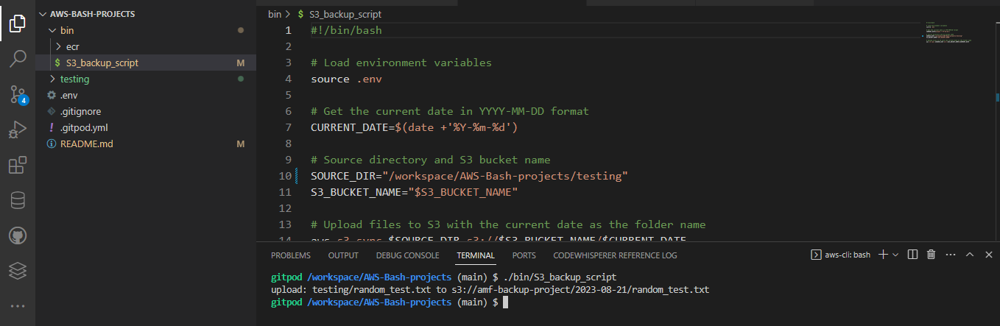
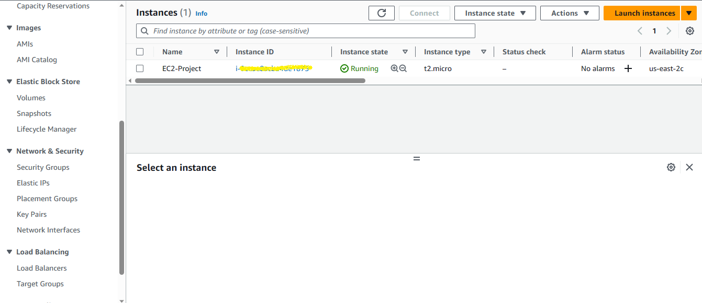
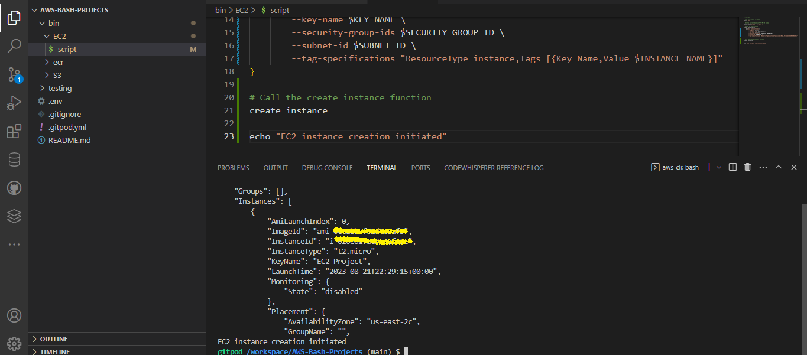
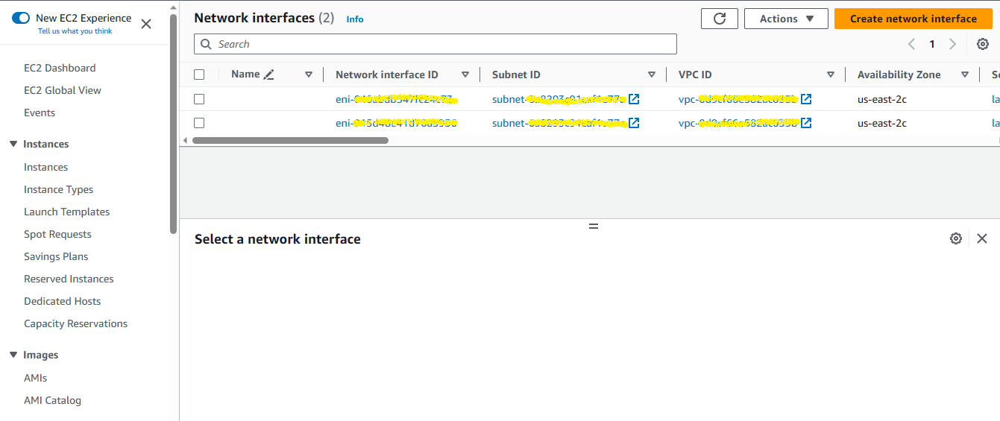
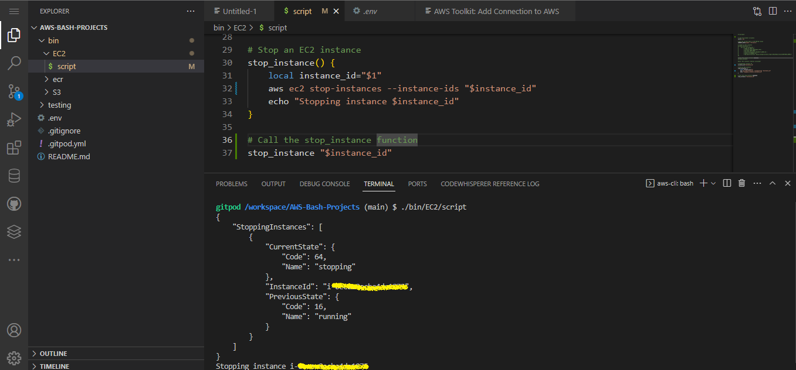
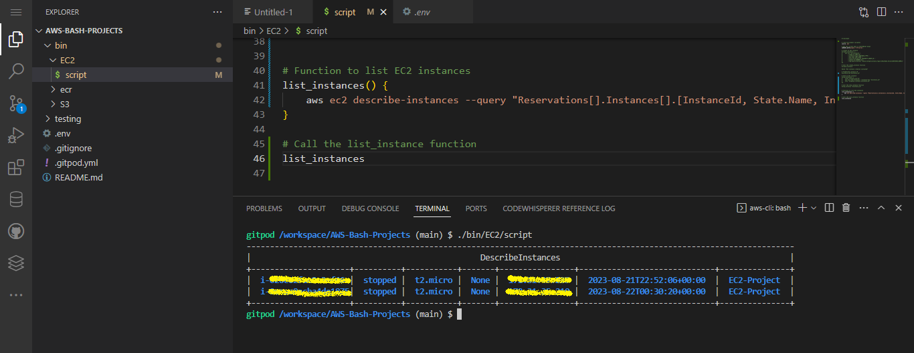

# AWS-Bash-Projects

##  1. S3 Backup Script

## Description:
Creating a Bash script that automates the backup of local files or directories to an AWS S3 bucket. I used the AWS CLI to interact with S3, upload files, and manage the backup process.

## Steps:

- I made sure to set up AWS CLI with my access and secret keys,alongside the default region.
- Furthermore, I created the Bash script.
- Made sure that the script was executable using  `chmod u+x ./bin/S3/backup_script.`
- I ran the script: `./bin/S3/backup_script.`


## Services Used:
- AWS CLI
- AWS S3


## Precautions
One of the safety measures I had to take was ensuring my AWS Credentials was secure by creating a `.env`file. Also, ensuring that the bucket policies and IAM permissions were correctly configured. 


## Challenges 
I had to ensure proper handling of files and permissions.This was the main challenge for me, and handling errors when creating the script for the backup process.

## Proof of Implementation
After running the `./bin/S3/backup_script.` The upload was successful.


 In addition, I had to check the S3 bucket to make sure it was actually uploaded  
.png)
.png)


##  2. EC2 Instance Script

## Description:
Creating a Bash script to manage AWS EC2 instances: list, start, stop, and create instances.

## Steps:
- I made sure to set up AWS CLI with my access and secret keys,alongside the default region.
- Furthermore, I created the Bash script.
- Made sure that the script was executable using  `chmod u+x ./bin/EC2/script.`
- I ran the script: `./bin/EC2/script.`

## Services Used:
- AWS CLI
- AWS EC2


## Precautions:
- I was cautuious when starting or stopping the instances to avoid accidental data loss.
- Also, for key management, I followed the security best practices.

## Challenges
Personally, I had issues with deleting network interfaces when I launched instances, but I had to first terminate these instances before proceeding to delete the network interface.
Furthermore, I had to add a case statement as to check the first argument ($1) provided when running the script. The value of $1 determines the operation to perform: create, start, stop, or list. This helped in performing different actions using a single script.

## Proof of Implementation
Before runnung the `./bin/EC2/script.`, I had to launch an instance in my AWS Console, because I need the `$AMI_ID`, `$SECURITY_GROUP_ID`,`$SUBNET_ID` to launch another instance. So I made sure to set environment variables for these values, for better security practices using the `export` and `gp env`



Furtheremore, I was able to launch a new instance using the AWS CLI.

```  # Create an EC2 instance
create_instance() {
    aws ec2 run-instances \
        --image-id $AMI_ID \
        --instance-type $INSTANCE_TYPE \
        --key-name $KEY_NAME \
        --security-group-ids $SECURITY_GROUP_ID \
        --subnet-id $SUBNET_ID \
        --tag-specifications "ResourceType=instance,Tags=[{Key=Name,Value=$INSTANCE_NAME}]"
}
```




After that, I could see the two instances running in EC2.


Then,I had to stop the initial instance I launched through the AWS Console, because I wanted only one instance to work with.


For stopping the second instance, I did this in my AWS CLI and it worked.

.png)

For listing all the Instances, this was made possible by going through AWS Documentation to find information on how to perform this operation. 



## 3. Serverless To-DO-List Application 

## Description:
In this project, the bash script automates the creation and deployment of the serverless to-do list application.It deploys an AWS Lambda function for handling POST AND GET operations, sets up an Amazon DynamoDB table to store the to-do items, creates an API Gateway to expose the Lambda function via a RESTful API, and deploys the API to a production stage.


## Services Used:
- AWS CLI
- AWS Lambda
- AWS DynamoDB
- AWS API Gateway
- AWS S3 
